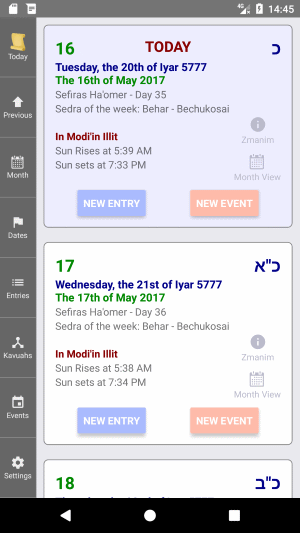

# Luach

**VERY IMPORTANT NOTE!**
The Luach Application is intented to be a helpful tool to keep track of a womens Halachic dates.

***The Luach Application has no Halachic status whatsoever, and can not take the place of a Rabbinic authority in any matter***.

If the app is relied upon for halachic matters in any shape or manner, there is a very high chance that severe trangressions of the laws of Taharas Hamishpacha will occur; many of which carry the penalty of *Kareis*.

**This page gives you a short explanation of the terms and features of Luach.**

* <a href="#TodayScreen">The Today Screen</a>
* <a href="#MonthViewScreen">The Month View Screen</a>
* <a href="#EntriesScreen">The Entries List Screen</a>
* <a href="#KavuahsScreen">The Kavuahs List Screen</a>
* <a href="#SettingsScreen">The Settings Screen</a>
* <a href="#Entries">Entry</a>
* <a href="#Kavuahs">Kavuah</a>
* <a href="#FlaggedDates">Flagged Date</a>

## **<a name="TodayScreen">The Today Screen</a>**

This is the screen that you will first come to when the the Luach app first opens.
It is called the Today Screen. 
On the right, there is a list of days. When  Luach loads, the top day is always the current day.
Within the box of each day, you will find some basic information about that day such as, 
* The Jewish Date
* The Secular Date
* The Sedra of the current week
* Any special information about this day such as Chol Ha`Moed, a fast day etc.

Under that, you will see your current location and the times for sunrise and sunset for this day at this location.
The location can be changed to almost any place in the world.
To change the location, click on the name of the location. You can also change the location from the <a href="#SettingsScreen">Settings Screen</a>.

On the right side of each day you will see a link to view the full Zmanim information for this day, and a link to view the entire month in the <a href="#MonthViewScreen">Month View Screen</a>.

On the bottom section of each day, you will see two buttons, New Entry and New Occasion.

### New Entry
Press on this button to create a new Entry for this day. 
You will be taken to the New Entry screen, with this day, already selected for you.
To undersand what an *Entry* is in the Luach app, see the <a href="#Entries">Entry section</a> below.

### New Entry
Press on this button to create a new Entry for this day.
To undersand what an *Entry* is in the Luach app, see the <a href="#Entries">Entry section</a> below.

## **<a name="MonthViewScreen">The Month View Screen</a>**

## **<a name="EntriesScreen">The Entries List Screen</a>**

## **<a name="KavuahsScreen">The Kavuahs List Screen</a>**

## **<a name="SettingsScreen">The Settings Screen</a>**

## **<a name="Entries">Entry</a>**

An Entry is a single seeing period. Luach uses the list of Entries to calculate the <a href="#FlaggedDates">Flagged Dates</a> and possible <a href="#Kavuahs">Kavuahs</a>. 

The list of Entries that have been added can be viewed from the <a href="#EntriesScreen">Entries List Screen</a>.

There are two places a new Entry can be added to the Entry list: 

1. On the <a href="#MainScreen">Main Screeen</a> or the <a href="#MonthViewScreen">Month View Screen</a>, Navigate to the Jewish date of the start of the entry and press on the New Entry button. In the new Entry screen, the date from which the New Entry button was pressed will be automatically selected.
2. From the the main menu on the right, press on the Entries button to open the <a href="#EntriesScreen">Entries List Screen</a> and then tap on the New Entry button.

Each Entry has the following properties:

**Jewish Date**

The day, month and year of the Jewish Date for the beginning of the period.

**Onah**

Each Jewish day is divided into two "*Onahs*"; the Night *Onah* and the Day *Onah*.

If the period began between sunset and sunrise, the Entry is conidered to have occurred during the Night *Onah*.
If it began between sunrise and sunset, it is considered to have occured during the Day *Onah*.

Luach is able to give you the time of sunset and sunrise for any location around the globe for any date.
Make sure that you have selected your current location on the Settings Screen, and that your device has the correct time and time zone for your location.

If the time of the start of the period is very close (within about 13 minutes) of the sunset or sunrise time, it is strongly advisable to contact your Rav to help determine the correct date and *Onah* for that Entry.

**Haflaga**

The number of days or partial days between the previous Entry and this one.
Upon the addition of an Entry, Luach automatically works out the *Haflaga* from the previous Entry.

## **<a name="Kavuahs">Kavuah</a>**

A Kavuah is a halachic term describing when a women has multiple periods in a recurring pattern.

When a women has a set Kavuah pattern, it is expected that periods will continue to occur in this pattern. This is until the pattern has been proven to have "broken".

Kavuah setting and breaking is a very complex Halachic issue and should aways be accompanied with Rabinic guidance.

There are many ways that recurring preiods can be considered to have occured in a pattern.

Here is a list of a few of the more common ones:
* **Yom HaChodesh /  Day of Month** - Three periods that all occur on the same date and *Onah* of the Jewish Month. For example if a period started on the Day of the 4th of Sivan, the Day of the 4th of Tammuz and the Day of the 4th of Av, this is considered a Kavuah of the Yom HaChodesh. Note, it is usually considered a Kavuah in this scenario, even if there were other periods in the days between these dates. As for everything else, a Rav should be consulted.
* **Haflaga / Interval** - Three periods in a row that started the same number of days after the period that preceded them. For example, if a period started on the Day Onah on the 4th of Sivan, and the next period started 29 days later during the Day Onah on the 2nd of Tammuz, and the following period started 29 days later during the Day Onah on the 1st of Av, and the following period started 29 days later during the Day Onah on the 29th of Av, this is considered a Kavuah of Haflaga. You may notice that to set this type of Kavuah, we need to calculate 4 periods as opossed to the *Yom HaChodesh* Kavuah where just 3 preiods can set the pattern.
* **Yom HaShavuah / Day of Week** - Three periods that occur on the same day of the week with the same number of weeks between them. For example, if a period started during the Day Onah on Monday the 4th of Sivan, and another period started 4 weeks later on Monday the 2nd of Tammuz, and a third period started on Monday 4 weeks later on Moday the 1st of Ellul, this a Kavuah of Yom Hashavuah. Similar to the Yom Hachodesh Kavuah, it usually does not matter if there were any other periods in the interim. Note, even if there were no other periods between these three Monday ones, this is not a Haflaga Kavuah as there were only two periods with a Haflaga of 29.
* **Dilug - Yom Hachodesh** - Three periods with the day of the month for each occuring on a recurring interval from one to the next. For example if a period started on the Day of the 4th of Sivan, the Day of the 5th of Tammuz and the Day of the 6th of Av, this is considered a Dilug Yom Hachodesh Kavuah of plus one day. In this scenario, it is expected that on the 7th of Ellul another period will occur. Dilug Kavuahs can have any pattern of days including negative ones. For example if a period started on the Day of the 4th of Sivan, the Day of the 3rd of Tammuz and the Day of the 2nd of Av, this is considered a Kavuah of the Dilug Yom HaChodesh with an interval of minus one day. In this scenario, it is expected that on the 1st of Ellul another period will occur.
* **Dilug - Haflaga** - - Three periods in a row where the interval from one to the next occurred in a recurring pattern. For example, For example, if a period started on the Day Onah on the 4th of Sivan, and the next period started 28 days later during the Day Onah on the 1st of Tammuz, and the following period started 29 days later during the Day Onah on the 1st of Av, and the following period started 30 days later during the Day Onah on the 30th of Av, this is considered a Kavuah of Dilug Haflaga with an interval of plus one day. In this scenario it is expected that another period will occur 31 days later - on the 1st of Tishrei. Similar to the regular Haflag Kavuah, the Dilug - Haflaga needs 4 periods to set it and it needs them to occur one after another with no other periods occuring during the interim.
* **Sirug** - Three periods in a row that are on the same Onah and the same day of the Jewish month and the same number of months in the interval between the first and second periods and the second and third periods. This is not a Yom Hachodesh Kavuah as the Yom Hachodesh needs a period on each subsequent month, while the Sirug Kavuah has some months in middle that are skipped.

In the Luach app, while adding a new Kavuah, the following properties wiil need to be filled out:

**Kavuah Type**

The type of Kavuah that is being set. For a brief explanation of some of the Kavuah types see the list above.

**Setting Entry**

**Kavuah Defining Number**

**Cancels Onah Beinonis**

**Active**

### Ignored Kavuahs
## **<a name="FlaggedDates">Flagged Date</a>**